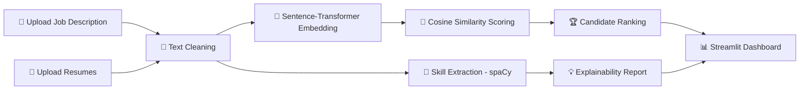

<div align="center">


<br/>


</div>

<br/>

## 📌 About The Project

**AI-Based Resume Screening System** is an intelligent, end-to-end application that automatically **reads, understands, ranks, and explains** how well a candidate's resume matches a given job description — using modern **transformer-based NLP embeddings** instead of shallow keyword matching.

Recruiters spend hours manually skimming resumes. This system compresses that process into seconds by:

- 🧠 Understanding the **meaning** behind resume text and job descriptions (not just literal words)
- 📊 Producing a **ranked shortlist** of the most relevant candidates
- 🔍 Explaining **exactly why** each candidate scored the way they did — so decisions stay transparent and auditable

> Built as a mid-level AI/ML internship project to demonstrate a real, production-style NLP pipeline — from raw file parsing to explainable semantic search.

<br/>

## ✨ Why This Project Is Useful

| Problem | How This Project Solves It |
|---|---|
| Manual resume screening is slow and inconsistent | Automates ranking in seconds using AI embeddings |
| Keyword-only ATS tools miss synonyms (e.g. "ML" vs "Machine Learning") | Uses **semantic similarity**, understanding meaning, not just words |
| AI decisions feel like a "black box" | Every score comes with a **skill-level explanation** (matched / missing / bonus skills) |
| Recruiters need proof, not just a number | Generates a **downloadable CSV report** for record-keeping |
| Supports multiple resume formats | Works with **PDF, DOCX, and TXT** out of the box |

<br/>

## 🎬 Demo Preview

<div align="center">

*(Add a GIF or screenshot of your running app here for maximum recruiter impact)*

```
📄 Upload Job Description → 📎 Upload Resumes → 🚀 Run Screening → 📊 Get Ranked, Explainable Results
```

</div>

<br/>

## 🚀 Features

- 📂 **Multi-format resume parsing** — PDF, DOCX, TXT supported
- 🧠 **Transformer-based semantic matching** using `all-MiniLM-L6-v2` (Sentence-Transformers)
- 📈 **Cosine similarity ranking** — fast, interpretable, and industry-standard
- 🔎 **Explainable AI layer** — matched skills, missing skills, and bonus skills per candidate
- 📊 **Interactive Streamlit dashboard** with live bar-chart visualizations
- ⬇️ **One-click CSV export** of ranked results
- 🔌 **Runs 100% locally** — no external API keys, no per-request costs
- ⚡ **Cached model loading** for fast repeated screenings within a session

<br/>

## 🏗️ Tech Stack

<div align="center">

| Layer | Technology |
|:---:|:---:|
| **Frontend / UI** |  |
| **Embeddings** |  `all-MiniLM-L6-v2` |
| **NLP / Skill Extraction** |  |
| **Similarity Scoring** |  |
| **File Parsing** | `pdfplumber` · `python-docx` |
| **Data Handling** |   |
| **Core Language** |  |

</div>

<br/>

## 🧩 How It Works (Architecture)



1. **Extraction** — Text is pulled from uploaded PDF/DOCX/TXT files.
2. **Cleaning** — Light preprocessing normalizes text while preserving natural language for the embedding model.
3. **Embedding** — Both the JD and every resume are converted into 384-dimensional semantic vectors.
4. **Scoring** — Cosine similarity measures how closely each resume aligns with the job description.
5. **Ranking** — Candidates are sorted from best to worst match.
6. **Explaining** — A rule-based skill matcher shows exactly which skills matched, which were missing, and which bonus skills the candidate brings.

<br/>

## 📂 Project Structure

```
resume_screening_ai/
├── app.py                      # Streamlit UI — entry point
├── src/
│   ├── __init__.py
│   ├── extractor.py            # PDF / DOCX / TXT text extraction
│   ├── preprocessor.py         # Text cleaning + skill extraction
│   ├── embedder.py             # Transformer embedding generation
│   ├── matcher.py               # Cosine similarity + ranking logic
│   └── explainer.py            # Human-readable match explanations
├── data/
│   └── sample_job_description.txt
├── requirements.txt
├── .gitignore
└── README.md
```

<br/>

## ⚙️ Installation & Setup (Windows PowerShell)

Follow these commands **exactly**, in order, after cloning/pulling the repo to your local machine.

### 1️⃣ Clone the repository

```powershell
git clone https://github.com/thrinathpolanki/resume_screening_ai.git
cd resume_screening_ai
```

### 2️⃣ Create a virtual environment (Python 3.11 recommended)

```powershell
py -3.11 -m venv venv
```

### 3️⃣ Activate the virtual environment

```powershell
venv\Scripts\activate
```

> ✅ Your terminal prompt should now show `(venv)` at the beginning.

### 4️⃣ Upgrade pip and install dependencies

```powershell
pip install --upgrade pip
pip install -r requirements.txt
```

### 5️⃣ Download the spaCy NLP model

```powershell
python -m spacy download en_core_web_sm
```

### 6️⃣ Verify the installation

```powershell
python -c "import spacy, streamlit, sentence_transformers; print('✅ All core packages installed successfully')"
```

<br/>

## ▶️ Running the App

```powershell
streamlit run app.py
```

The app will automatically open in your browser at:

```
http://localhost:8501
```

> 💡 On first run, the `all-MiniLM-L6-v2` model (~90MB) downloads automatically from Hugging Face and is cached locally — subsequent runs work fully offline.

<br/>

## 🧪 How To Test It

1. Open the app and select **"Paste text"** for the job description.
2. Copy the contents of `data/sample_job_description.txt` into the box.
3. Create a few sample `.txt` resumes — one closely matching the JD (Python, ML, Docker) and one unrelated (e.g. marketing).
4. Upload them and click **🚀 Run Screening**.
5. Confirm the highly relevant resume ranks **#1** with a higher score, and expand each candidate card to review the matched/missing skill breakdown.

<br/>

## 🗺️ Roadmap / Future Improvements

- [ ] Fine-tune embeddings on a labeled resume/JD dataset for domain-specific accuracy
- [ ] Add Named Entity Recognition for years of experience & education level
- [ ] Integrate a vector database (FAISS / Pinecone) for large-scale resume search
- [ ] Add authentication + persistent storage for multi-user recruiter workflows
- [ ] Deploy a FastAPI backend for ATS (Applicant Tracking System) integration
- [ ] Add bias/PII auditing before embedding generation

<br/>

## 🤝 Contributing

Contributions, issues, and feature requests are welcome!

```powershell
# Fork the repo, then:
git checkout -b feature/your-feature-name
git commit -m "Add: your feature description"
git push origin feature/your-feature-name
# Then open a Pull Request 🚀
```

<br/>

## 📜 License

This project is licensed under the **MIT License** — free to use, modify, and distribute.

<br/>

---

<div align="center">

## 👨‍💻 Author


<br/>

[](https://github.com/thrinathpolanki)
[](https://linkedin.com/in/thrinathpolanki)
[](mailto:polankithrinath@gmail.com)

<br/>

### ⭐ If you found this project useful, consider giving it a star — it really helps!


</div>
